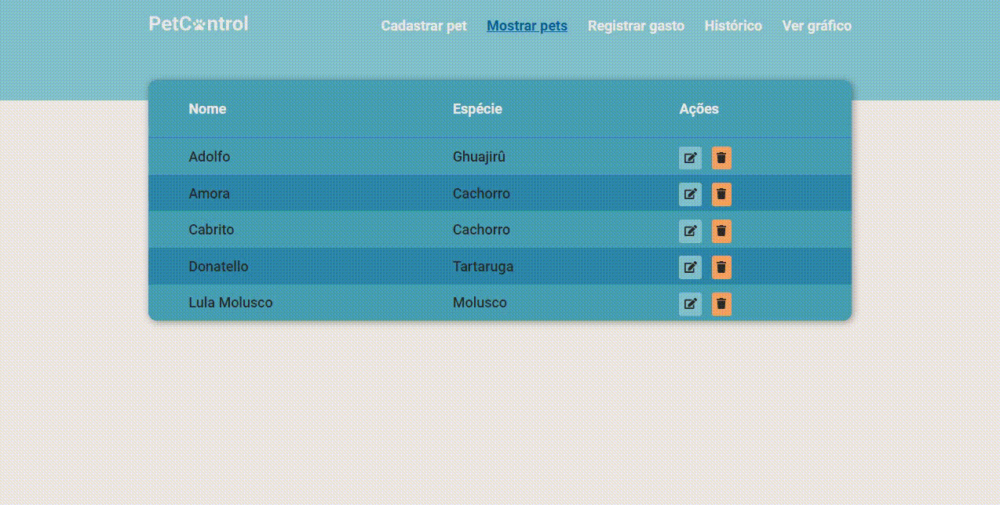

# PetControl

## Lista de Conteúdos 

* [Sobre o Projeto](#Sobre-o-Projeto)
  * [Construído com](#computer-built-with)
* [Getting Started](#getting-started)
* [Meta](#meta)

---

<!-- ABOUT THE PROJECT -->
## Sobre o Projeto:

### Projeto desafio da Contabilus onde o frontend da aplicação deve ser implementado em Angular, backend (API) em node.js e usando um baco de dados relacional para a persistência dos dados 
<p align="center">
  
  <p align="center">
    
    
  </p>
</p>

---

## :computer: Tecnologias:

Principais tecnologias utilizadas no projeto.

* Angular 
* Nodejs
* Typescript   
* SCSS
* Mysql
* TypeOrm

---

<!-- GETTING STARTED -->
# Getting Started

```bash
# Clone Repository
$ git clone https://github.com/Lucas-Vinicius-Santos/PetControl.git

# Install Dependencies
$ yarn or npm install

# Run Aplication
$ cd ./frontend && ng serve
$ cd ./backend npm run typeorm migration:run && npm run dev

```
:eyes: Vá para http://localhost:4200/ e veja o resultado.

---

## Meta

Lucas Santos – [](https://www.linkedin.com/in/lucas-santos-4519aa1b0/) 
| 
[](mailto:vinicius.santoss.dev@gmail.com)

This project is under the [MIT license](./LICENSE).

[https://github.com/Lucas-Vinicius-Santos/github-link](https://github.com/Lucas-Vinicius-Santos)

